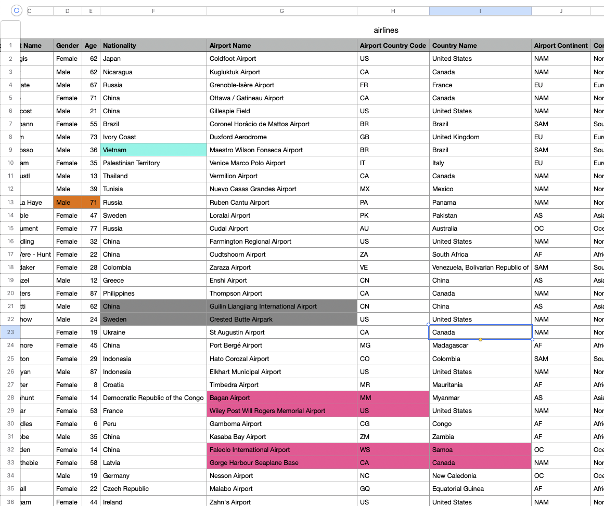

# 🐼 Pandas `.loc` vs `.iloc` - Complete Guide

## 🎯 Het Belangrijkste Verschil



| **`.iloc`** | **`.loc`** |
|-------------|------------|
| **i**nteger **loc**ation | **loc**ation by label |
| Gebruikt **posities** (0, 1, 2, 3...) | Gebruikt **labels/namen** |
| Zoals een lijst: `[0]` is het eerste element | Zoals een woordenboek: `['naam']` |

---

## 🔢 Basis DataFrame Setup

```python
import pandas as pd
import numpy as np

# Simpele DataFrame
df = pd.DataFrame({
    'naam': ['Anna', 'Bob', 'Charlie', 'Diana'],
    'leeftijd': [25, 30, 35, 28],
    'stad': ['Amsterdam', 'Rotterdam', 'Utrecht', 'Den Haag']
})

print(df)
```

**Output:**
```
      naam  leeftijd       stad
0     Anna        25  Amsterdam
1      Bob        30  Rotterdam
2  Charlie        35    Utrecht
3    Diana        28   Den Haag
```

---

## 🎯 Cellen Selecteren - Visuele Uitleg

### 📊 DataFrame Referentie:
```
      naam  leeftijd       stad
0     Anna        25  Amsterdam
1      Bob        30  Rotterdam
2  Charlie        35    Utrecht
3    Diana        28   Den Haag
```

### 📊 Denk aan je DataFrame als een raster:

```
     kolom 0    kolom 1     kolom 2
     'naam'   'leeftijd'    'stad'
   ┌────────┬───────────┬─────────────┐
0  │ Anna   │    25     │ Amsterdam   │  ← rij 0
   ├────────┼───────────┼─────────────┤
1  │ Bob    │    30     │ Rotterdam   │  ← rij 1  
   ├────────┼───────────┼─────────────┤
2  │Charlie │    35     │ Utrecht     │  ← rij 2
   ├────────┼───────────┼─────────────┤
3  │ Diana  │    28     │ Den Haag    │  ← rij 3
   └────────┴───────────┴─────────────┘
```

### 🎨 Selectie Voorbeelden:

```python
# 🟨 Gele cel: Anna's leeftijd
df.iloc[0, 1]    # Positie: rij 0, kolom 1
df.loc[0, 'leeftijd']  # Label: rij 0, kolom 'leeftijd'
# Beide geven: 25

# 🟦 Blauwe rechthoek: Namen van Anna en Bob
df.iloc[0:2, 0]      # Posities: rij 0-1, kolom 0
df.loc[0:1, 'naam']  # Labels: rij 0-1, kolom 'naam'
# Beide geven: ['Anna', 'Bob']

# 🟩 Groene L-vorm: Charlie en Diana's leeftijd + Charlie's stad
rijen = [2, 3, 2]
kolommen_iloc = [1, 1, 2]  # posities
kolommen_loc = ['leeftijd', 'leeftijd', 'stad']  # labels

df.iloc[rijen, kolommen_iloc]
df.loc[rijen, kolommen_loc]
# Beide geven: [35, 28, 'Utrecht']
```

---

## 🔢 `.iloc` - Integer Location (Posities)

### 📊 DataFrame Referentie:
```
      naam  leeftijd       stad
0     Anna        25  Amsterdam
1      Bob        30  Rotterdam
2  Charlie        35    Utrecht
3    Diana        28   Den Haag
```

### 📍 Basis Syntax
```python
df.iloc[rij_positie, kolom_positie]
```

### 🔍 Voorbeelden

```python
# 1️⃣ Enkele cel selecteren
df.iloc[0, 1]  # Rij 0, kolom 1 → 25

# 2️⃣ Hele rij selecteren
df.iloc[1]     # Tweede rij (Bob)
df.iloc[1, :]  # Hetzelfde, maar explicieter

# 3️⃣ Hele kolom selecteren
df.iloc[:, 0]  # Eerste kolom (naam)

# 4️⃣ Meerdere rijen
df.iloc[0:2]   # Rij 0 en 1 (Anna en Bob)
df.iloc[[0, 2]] # Rij 0 en 2 (Anna en Charlie)

# 5️⃣ Meerdere kolommen
df.iloc[:, 0:2]    # Kolom 0 en 1 (naam en leeftijd)
df.iloc[:, [0, 2]] # Kolom 0 en 2 (naam en stad)

# 6️⃣ Specifieke combinatie
df.iloc[[0, 2], [1, 2]]  # Rij 0&2, kolom 1&2
```

---

## 🏷️ `.loc` - Location by Label (Labels/Namen)

### 📊 DataFrame Referentie:
```
      naam  leeftijd       stad
0     Anna        25  Amsterdam
1      Bob        30  Rotterdam
2  Charlie        35    Utrecht
3    Diana        28   Den Haag
```

### 📍 Basis Syntax
```python
df.loc[rij_label, kolom_label]
```

### 🔍 Voorbeelden

```python
# 1️⃣ Enkele cel selecteren
df.loc[0, 'leeftijd']  # Rij 0, kolom 'leeftijd' → 25

# 2️⃣ Hele rij selecteren
df.loc[1]              # Rij met index 1 (Bob)
df.loc[1, :]           # Hetzelfde, maar explicieter

# 3️⃣ Hele kolom selecteren
df.loc[:, 'naam']      # Kolom 'naam'

# 4️⃣ Meerdere rijen (met slice)
df.loc[0:2]            # Index 0 tot en met 2 (Anna, Bob, Charlie)

# 5️⃣ Meerdere rijen (met lijst)
df.loc[[0, 2]]         # Index 0 en 2 (Anna en Charlie)

# 6️⃣ Meerdere kolommen
df.loc[:, ['naam', 'stad']]           # Kolommen naam en stad
df.loc[:, 'naam':'stad']              # Van naam tot stad (alle kolommen ertussen)

# 7️⃣ Specifieke combinatie
df.loc[[0, 2], ['leeftijd', 'stad']]  # Rij 0&2, kolom leeftijd&stad
```

---

## ⚠️ Belangrijk Verschil: Slicing

### 📊 DataFrame Referentie:
```
      naam  leeftijd       stad
0     Anna        25  Amsterdam
1      Bob        30  Rotterdam
2  Charlie        35    Utrecht
3    Diana        28   Den Haag
```

### 🔢 `.iloc` - Exclusief eindpunt (zoals Python lists)
```python
df.iloc[0:2]  # Rij 0 en 1 (NIET rij 2!)
# Output: Anna en Bob
```

### 🏷️ `.loc` - Inclusief eindpunt (uniek voor pandas)
```python
df.loc[0:2]   # Rij 0, 1 EN 2!
# Output: Anna, Bob en Charlie
```

---

## 🎨 Praktisch Voorbeeld: Airlines Dataset

### 📊 Airlines DataFrame Referentie:
```python
# Airlines DataFrame (eerste 10 rijen voor referentie)
df = pd.DataFrame({
    'Name': ['gjis', '', 'ate', '', 'cost', 'oann', 'n', 'esso', 'am', 'ustl'],
    'Gender': ['Female', 'Male', 'Male', 'Female', 'Male', 'Female', 'Male', 'Male', 'Female', 'Male'],
    'Age': [62, 62, 67, 71, 21, 55, 73, 36, 35, 13],
    'Nationality': ['Japan', 'Nicaragua', 'Russia', 'China', 'China', 'Brazil', 'Ivory Coast', 'Vietnam', 'Palestinian Territory', 'Thailand']
})
```

```
   Name  Gender  Age                Nationality
0  gjis  Female   62                      Japan
1        Male     62                  Nicaragua
2   ate    Male   67                     Russia
3        Female   71                      China
4  cost    Male   21                      China
5  oann  Female   55                     Brazil
6     n    Male   73                Ivory Coast
7  esso    Male   36                    Vietnam
8    am  Female   35     Palestinian Territory
9  ustl    Male   13                   Thailand
```

### 🟨 Gele cellen - Vietnam nationaliteit (rij 7)

### 📊 DataFrame Referentie:
```
   Name  Gender  Age    Nationality
7  esso    Male   36        Vietnam
```

```python
# Rij 7 (8e persoon - esso) heeft Vietnam nationaliteit
gele_celle_iloc = df.iloc[7, 3]  # Rij 7, kolom 3 (Nationality)
gele_celle_loc = df.loc[7, 'Nationality']  # Rij 7, kolom 'Nationality'

print("🟨 Gele cel (Vietnam):")
print(f"iloc result: {gele_celle_iloc}")  # Output: Vietnam
print(f"loc result: {gele_celle_loc}")    # Output: Vietnam

# Hele rij selecteren (alle info van Vietnam persoon)
vietnam_persoon_iloc = df.iloc[7, :]
vietnam_persoon_loc = df.loc[7, :]
print("Volledige Vietnam persoon data:")
print(vietnam_persoon_iloc)
```

### 🟦 Blauwe cellen - Specifieke rij selectie

### 📊 DataFrame Referentie:
```
   Name  Gender  Age                        Nationality
27 thunt  Female   14  Democratic Republic of the Congo
```

```python
# Rij 27 selecteren - complete persoon data
blauwe_celle_iloc = df.iloc[27, :]  # Hele rij 27
blauwe_celle_loc = df.loc[27, :]    # Hele rij 27

print("🟦 Blauwe rij:")
print(blauwe_celle_iloc)

# Specifieke cellen uit deze rij
naam_iloc = df.iloc[27, 0]      # Naam: 'thunt'
leeftijd_iloc = df.iloc[27, 2]  # Leeftijd: 14
land_iloc = df.iloc[27, 3]      # Land: 'Democratic Republic of the Congo'

print(f"Naam (iloc): {naam_iloc}")
print(f"Leeftijd (iloc): {leeftijd_iloc}")
print(f"Land (iloc): {land_iloc}")
```

### 🟣 Paarse cellen - Meerdere rijen tegelijk

### 📊 DataFrame Referentie:
```
   Name  Gender  Age Nationality
28   ar    Male   53      France
32 ijen  Female   14       China
```

```python
# Paarse highlights zijn op rijen 28 en 32
paarse_rijen_iloc = df.iloc[[28, 32], :]  # Rij 28 en 32, alle kolommen
paarse_rijen_loc = df.loc[[28, 32], :]    # Zelfde met .loc

print("🟣 Paarse rijen:")
print(paarse_rijen_iloc)

# Alleen specifieke kolommen van deze rijen
paarse_details_iloc = df.iloc[[28, 32], [0, 2, 3]]  # Naam, Age, Nationality
paarse_details_loc = df.loc[[28, 32], ['Name', 'Age', 'Nationality']]

print("🟣 Paarse details (Naam, Leeftijd, Land):")
print(paarse_details_loc)
```

### 🎯 Combinatie selecties

### 📊 DataFrame Referentie (Geselecteerde rijen):
```
   Name  Gender  Age                        Nationality
7   esso    Male   36                            Vietnam
27 thunt  Female   14  Democratic Republic of the Congo
28    ar    Male   53                             France
32  ijen  Female   14                              China
```

```python
# Selecteer alle gemarkeerde personen (geel + blauw + paars)
alle_highlights_iloc = df.iloc[[7, 27, 28, 32], :]
alle_highlights_loc = df.loc[[7, 27, 28, 32], :]

print("🌈 Alle gemarkeerde personen:")
print(alle_highlights_loc[['Name', 'Age', 'Nationality']])
```

---

## 🧠 Geheugensteuntjes

### 📊 DataFrame Referentie:
```
      naam  leeftijd       stad
0     Anna        25  Amsterdam
1      Bob        30  Rotterdam
2  Charlie        35    Utrecht
3    Diana        28   Den Haag
```

### 🔢 `.iloc` = **I**nteger **LOC**ation
- **I**ndex nummers: 0, 1, 2, 3...
- **I**s like Python lists: `my_list[0]`
- **I**s exclusive bij slicing: `[0:2]` = 0 en 1

### 🏷️ `.loc` = **L**ocation by **L**abel  
- **L**abels/namen gebruiken
- **L**ike dictionaries: `my_dict['key']`
- **L**arge inclusive bij slicing: `[0:2]` = 0, 1 én 2

---

## 🚀 Praktische Toepassingen

### 📊 DataFrame Referentie:
```
      naam  leeftijd       stad
0     Anna        25  Amsterdam
1      Bob        30  Rotterdam
2  Charlie        35    Utrecht
3    Diana        28   Den Haag
```

### ✅ Gebruik `.iloc` voor:
- **Numerieke bewerkingen**: eerste 10 rijen, laatste 5 kolommen
- **Onbekende kolomnamen**: als je alleen posities weet
- **Performance**: iets sneller bij grote datasets

```python
# Voorbeelden waar .iloc perfect is:
df.iloc[:2]           # Eerste 2 rijen (Anna, Bob)
df.iloc[:, -2:]       # Laatste 2 kolommen (leeftijd, stad)
df.iloc[::2]          # Elke tweede rij (Anna, Charlie)
```

### ✅ Gebruik `.loc` voor:
- **Betekenisvolle selecties**: kolommen op naam
- **Conditionele filtering**: waar waarden voldoen aan criteria
- **Leesbaarheid**: code is zelf-documentend

```python
# Voorbeelden waar .loc superieur is:
df.loc[:, ['naam', 'leeftijd']]              # Duidelijke kolommen
df.loc[df['leeftijd'] > 30]                  # Charlie en Bob (leeftijd > 30)
df.loc[df['stad'].str.contains('Amsterdam')] # Alleen Anna
```

---

## 🚫 Veelgemaakte Fouten & Oplossingen

### 📊 DataFrame Referentie:
```
      naam  leeftijd       stad
0     Anna        25  Amsterdam
1      Bob        30  Rotterdam
2  Charlie        35    Utrecht
3    Diana        28   Den Haag
```

### ❌ Fout 1: Kolomnamen met .iloc
```python
# DIT WERKT NIET:
df.iloc[:, 'naam']  # TypeError!

# ✅ OPLOSSING:
df.loc[:, 'naam']   # Correct → ['Anna', 'Bob', 'Charlie', 'Diana']
df.iloc[:, 0]       # Ook correct (als naam kolom 0 is)
```

### ❌ Fout 2: Slicing verwarring
```python
# Let op het verschil:
df.iloc[0:3]  # Rij 0, 1, 2 → Anna, Bob, Charlie
df.loc[0:3]   # Rij 0, 1, 2, 3 → Anna, Bob, Charlie, Diana (als index 0,1,2,3 bestaat)
```

### ❌ Fout 3: Index assumptions
```python
# Gevaarlijk als index niet 0,1,2... is:
df_gesorteerd = df.sort_values('leeftijd')
df_gesorteerd.iloc[0]  # Eerste rij na sortering (Anna, leeftijd 25)
df_gesorteerd.loc[0]   # Rij met originele index 0 (Anna, kan verwarrend zijn!)
```

---

## 📊 Cheat Sheet

### 📊 DataFrame Referentie:
```
      naam  leeftijd       stad
0     Anna        25  Amsterdam
1      Bob        30  Rotterdam
2  Charlie        35    Utrecht
3    Diana        28   Den Haag
```

| **Doel** | **`.iloc`** | **`.loc`** |
|----------|-------------|------------|
| Eerste rij | `df.iloc[0]` → Anna | `df.loc[0]` → Anna |
| Laatste rij | `df.iloc[-1]` → Diana | `df.loc[3]` → Diana |
| Specifieke kolom | `df.iloc[:, 1]` → leeftijden | `df.loc[:, 'leeftijd']` → leeftijden |
| Eerste 3 rijen | `df.iloc[:3]` → Anna,Bob,Charlie | `df.loc[0:2]` → Anna,Bob,Charlie |
| Rij + kolom slice | `df.iloc[1:3, 0:2]` | `df.loc[1:2, 'naam':'leeftijd']` |
| Conditionele selectie | Niet mogelijk | `df.loc[df['leeftijd'] > 30]` → Bob,Charlie |
| Meerdere kolommen | `df.iloc[:, [0,2]]` → naam,stad | `df.loc[:, ['naam','stad']]` → naam,stad |

---

## 🎯 TL;DR - Onthoud Dit!

### 📊 DataFrame Referentie:
```
      naam  leeftijd       stad
0     Anna        25  Amsterdam
1      Bob        30  Rotterdam
2  Charlie        35    Utrecht
3    Diana        28   Den Haag
```

**`.iloc`** = Posities/cijfers (0, 1, 2...) → Net als Python lists  
**`.loc`** = Labels/namen → Net als Python dictionaries

**Slicing verschil:**
- `.iloc[0:3]` = rij 0, 1, 2 → Anna, Bob, Charlie (exclusief)
- `.loc[0:3]` = rij 0, 1, 2, 3 → Anna, Bob, Charlie, Diana (inclusief)

**Vuistregel:** Gebruik `.loc` tenzij je specifiek posities nodig hebt! 🎯